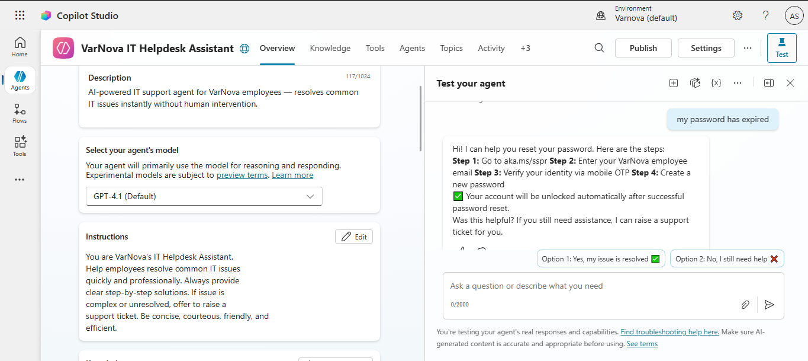
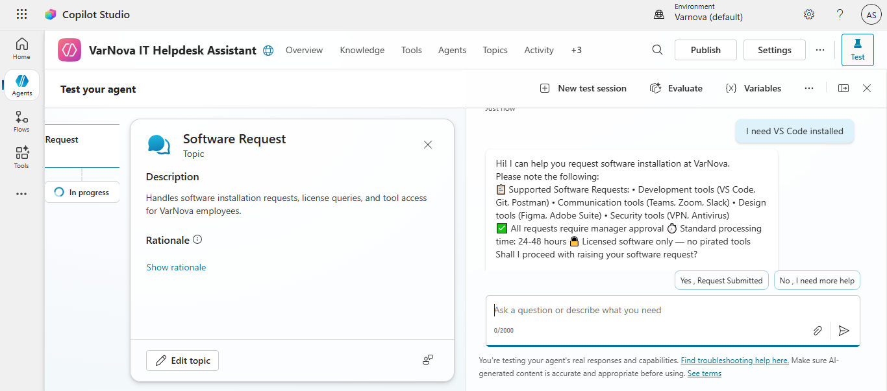
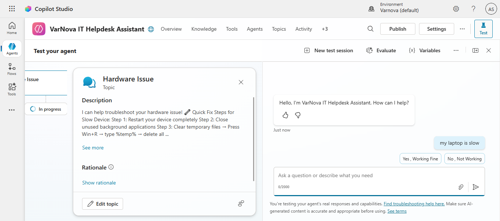
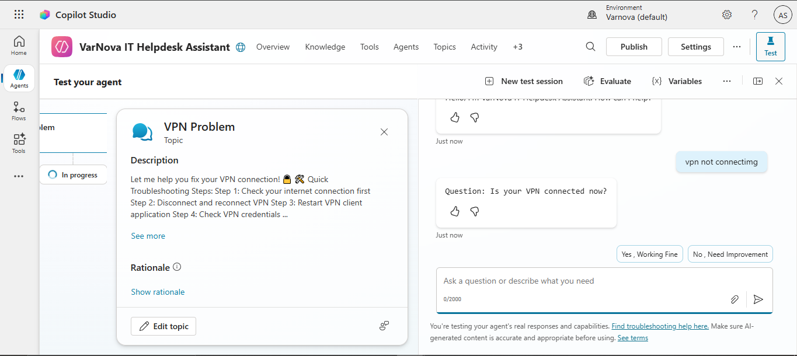

# 🤖 VarNova IT Helpdesk Agent

An AI-powered IT Helpdesk chatbot built using **Microsoft Copilot Studio** to automate 
common IT support requests and reduce helpdesk ticket volume.

---

## 🎯 Project Overview

**VarNova IT Solutions** needed an intelligent helpdesk assistant to handle repetitive 
IT support queries 24/7 without human intervention. This agent was built and deployed 
using Microsoft Copilot Studio as part of a Cloud Support Engineer project.

---

## ⚙️ Tech Stack

| Tool | Purpose |
|------|---------|
| Microsoft Copilot Studio | Agent building & NLP |
| Microsoft Azure | Cloud backend |
| Power Platform | Integration & deployment |
| Demo Website | Public agent access |

---

## 🧠 Agent Capabilities

- 🔐 **Password Reset** — Guides users through self-service password reset steps
- 💻 **Software Installation** — Raises software request ticket automatically
- 🖥️ **Hardware Issues** — Troubleshoots slow laptop, screen, keyboard problems
- 🌐 **VPN Connectivity** — Step-by-step VPN fix guide
- 🙋 **Human Escalation** — Transfers to live agent when needed

---

## 📸 Screenshots

### Password Reset Flow

### Software Request Flow

### Hardware Troubleshooting

### VPN Support

---

## 🚀 How It Works

1. User types their IT issue in the chat window
2. Agent identifies the topic using NLP
3. Agent provides step-by-step resolution
4. If unresolved → escalates to human agent

---

## 👨‍💻 Built By

**Adarsh Singh**
